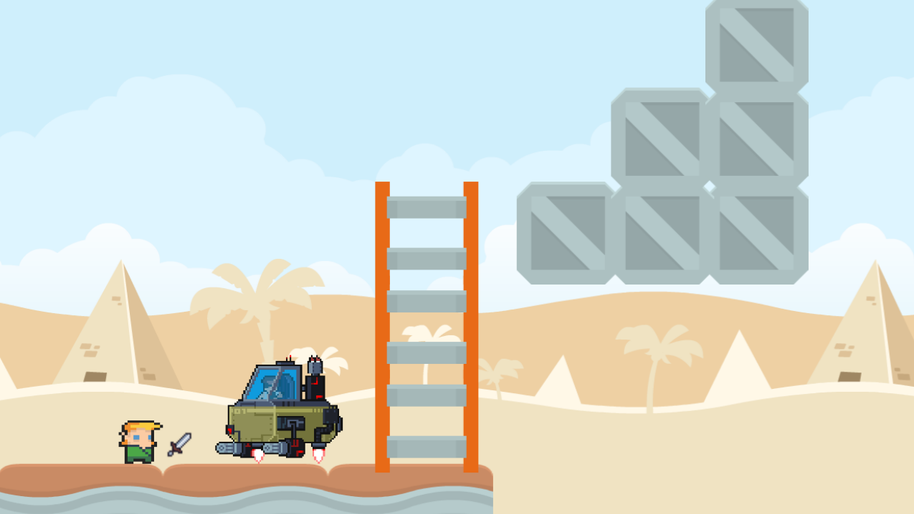
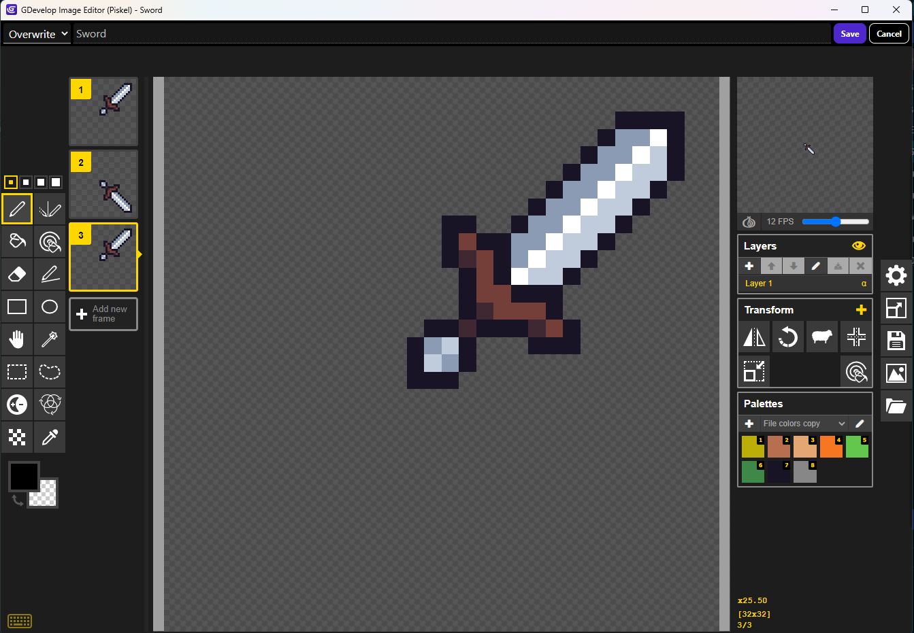
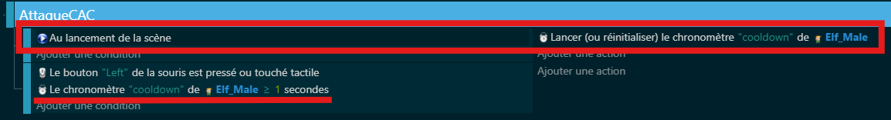
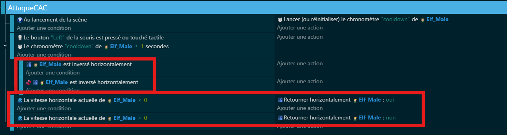
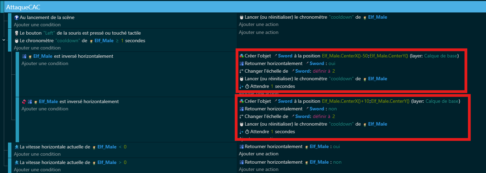
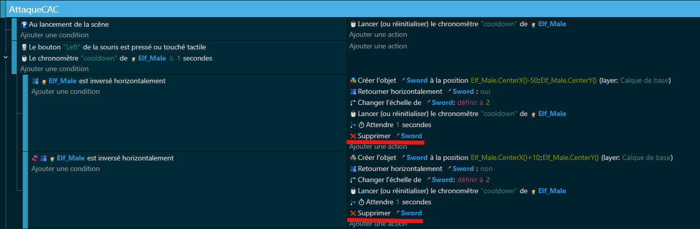
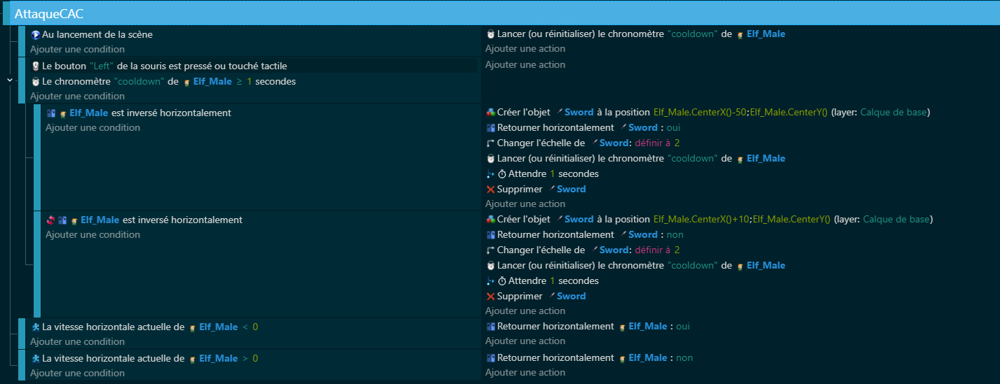
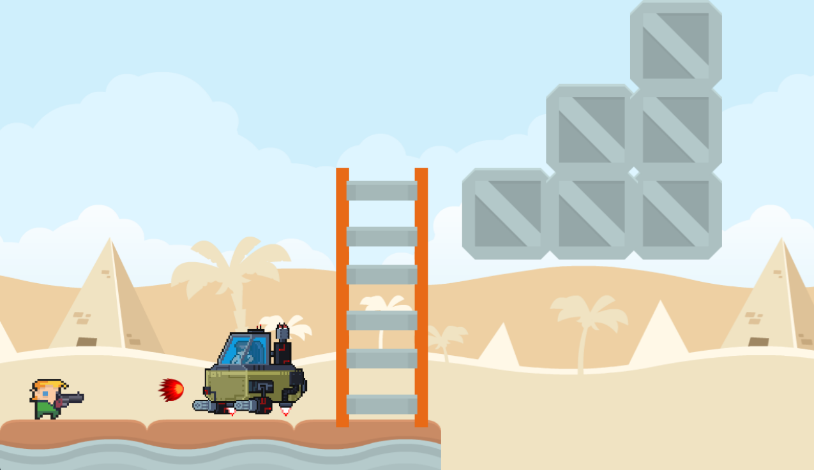
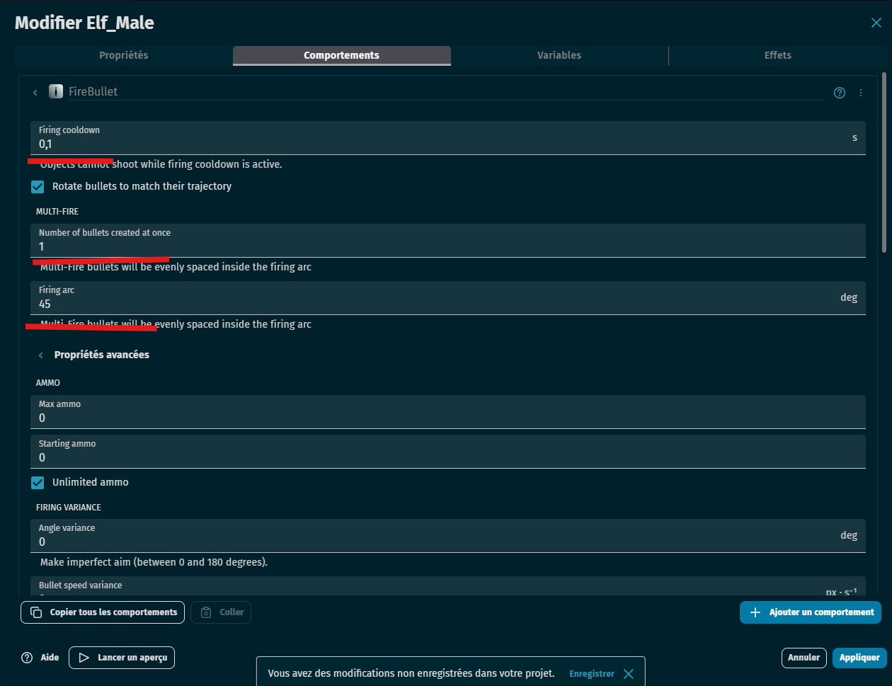
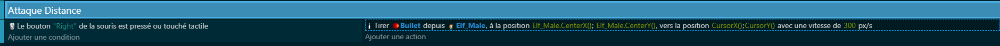

# 🗡️ Attaque au corps à corps avec animation d'épée

## 🧰 Préparation du projet

- Créer un personnage joueur (`Elf_Male`) avec :
  - Le comportement **personnage se déplaçant sur des plateformes**. (Pour un side scroller 2D)
- Créer un objet `Sword` :
  - Avec une animation de slash ou coup d’épée.

---

## 🖼️ Étape 1 : Ajouter l’animation de l’épée

- Importer ou dessiner une animation représentant un coup d’épée.
- S’assurer qu’elle se joue automatiquement à la création de l’objet.

---

## 🎮 Étape 2 : Déclencher l’attaque

- Lancer l’attaque uniquement si le bouton gauche de la souris est cliqué.

---

## 🕒 Étape 3 : Ajouter un cooldown

- Bloquer l’attaque si le **minuteur "cooldown"** est inférieur à 1 seconde.
- Réinitialiser ce minuteur à chaque attaque.

---

## ↔️ Étape 4 : Détecter l’orientation du joueur

- Si le joueur va à gauche, le retourner (FlipX).
- Si le joueur va à droite, annuler le retournement.

---

## ⚔️ Étape 5 : Créer l’objet Sword selon l’orientation

- Positionner l’épée à gauche si le joueur est retourné.
- Positionner l’épée à droite sinon.
- Agrandir ou ajuster l’objet si besoin.

**Attention** :  Dans mon cas le " -50 " et " +10 " correspond a un décalage afin que l'épée soit devant le player quand il tape.

---

## ⏱️ Étape 6 : Supprimer l’épée après un court délai

- Supprimer `Sword` automatiquement après 1 seconde pour simuler un coup rapide.

---

## ✅ Résultat attendu

Le joueur peut attaquer dans la direction où il regarde, avec une **animation temporaire d’épée**, tout en respectant un **délai entre chaque attaque**.

# 🎯 Attaque a distance

## 🧰 Préparation du projet

- Créer un objet **joueur** (`Elf_Male`) avec le comportement **Platformer**.
- Créer un objet **projectile** (par exemple `Arrow`, `Bullet` ou `Fireball`) :
  - Forme simple (cercle, flèche…).
  - Animation facultative.

---

## 🔫 Étape 1 : Ajouter le comportement `FireBullet`

- Sélectionner l’objet `Elf_Male`.
- Cliquer sur **Ajouter un comportement** → **Fire Bullet**.
- Paramétrer :
  - Vitesse (ex. : 500).
  - Nombre de balle par tir (ex. : 1).
  - Nom du tir (facultatif si un seul type de tir).

---

## 🖱️ Étape 2 : Tirer en direction de la souris

- Quand le **joueur clique bouton Droit**, il tire une flèche.
- Le projectile est tiré **depuis le joueur vers la position de la souris**.
- Le tir part du **centre du joueur** (ou légèrement devant).

## ✅ Résultat attendu

En cliquant, le joueur tire des flèches vers la souris.  
Les projectiles se déplacent automatiquement grâce au comportement **FireBullet**.

---

## 🧠 À noter (pour aller plus loin)

Le comportement `FireBullet` permet aussi de :
- Tirer **dans une direction fixe** (angle).
- Tirer avec une **précision variable** (aléatoire).
- Ajouter des **effets visuels ou sons**.
- Déclencher le tir avec un **timer ou une animation**.
- Définir des **dommages et collisions** (avec un ennemi, un mur...).
