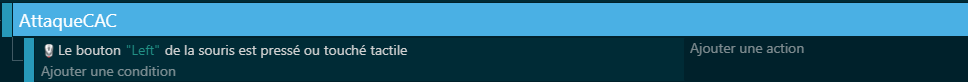

# 🗡️ Attaque au corps à corps avec animation d'épée

## 🧰 Préparation du projet

- Créer un personnage joueur (`Elf_Male`) avec :
  - Le comportement personnage se déplaçant sur des plateformes. (Pour un side scroller 2D)
- Créer un objet `Sword` :
  - Avec une animation de slash ou coup d’épée.

---

## 🖼️ Étape 1 : Ajouter l’animation de l’épée

- Importer ou dessiner une animation représentant un coup d’épée.
- S’assurer qu’elle se joue automatiquement à la création de l’objet.

---

## 🎮 Étape 2 : Déclencher l’attaque

- Lancer l’attaque uniquement si le bouton gauche de la souris est cliqué.

---

## 🕒 Étape 3 : Ajouter un cooldown

- Bloquer l’attaque si le **minuteur "cooldown"** est inférieur à 1 seconde.
- Réinitialiser ce minuteur à chaque attaque.

---

## ↔️ Étape 4 : Détecter l’orientation du joueur

- Si le joueur va à gauche, le retourner (FlipX).
- Si le joueur va à droite, annuler le retournement.

---

## ⚔️ Étape 5 : Créer l’objet Sword selon l’orientation

- Positionner l’épée à gauche si le joueur est retourné.
- Positionner l’épée à droite sinon.
- Agrandir ou ajuster l’objet si besoin.

**Attention** :  Dans mon cas le " -50 " et " +10 " correspond a un décalage afin que l'épée soit devant le player quand il tape.

---

## ⏱️ Étape 6 : Supprimer l’épée après un court délai

- Supprimer `Sword` automatiquement après 1 seconde pour simuler un coup rapide.

---

## ✅ Résultat attendu

Le joueur peut attaquer dans la direction où il regarde, avec une **animation temporaire d’épée**, tout en respectant un **délai entre chaque attaque**.

