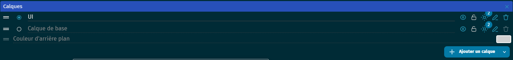
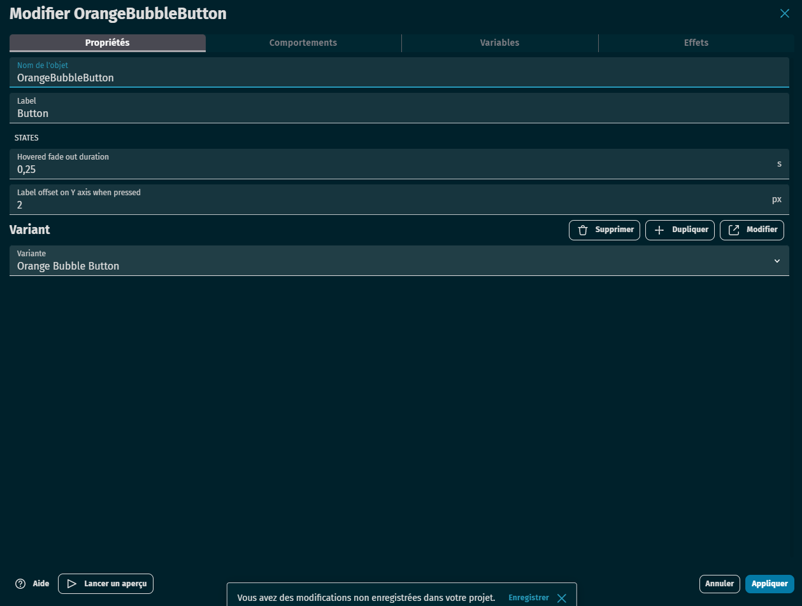
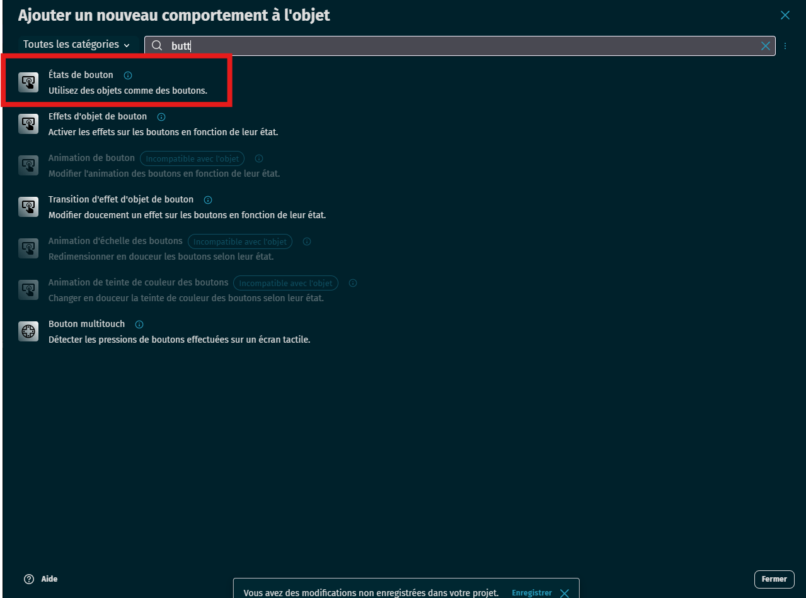
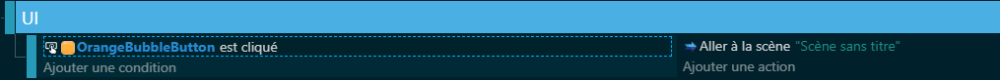

# 🖱️ Créer des boutons interactifs 

## 🧰 Pré-requis

- Une scène existante
- Un calque UI pour les éléments d’interface

---

## 🛠 Étape 1 : Créer un nouveau calque pour l’interface

**Pourquoi ?**  
Les éléments de l’interface (comme les boutons) ne doivent **pas bouger avec la caméra**. Il faut donc les placer sur un calque fixe.

- Ouvre l’onglet **Calques**
- Clique sur **Ajouter un calque**
- Nomme-le par exemple `UI`

---

## ➕ Étape 2 : Ajouter un objet bouton

- Clique sur **Ajouter un objet**
- Choisis **"Bouton"**
- Personnalise-le (texte, style, couleur…)
- Place-le sur le calque `UI`

Le bouton est un objet spécial avec **des états automatiques** : normal, survolé, cliqué, désactivé.

---

## ⚙️ Étape 3 : Ajouter le comportement "Bouton"

- Sélectionne ton objet bouton
- Clique sur **Ajouter un comportement**
- Choisis **"Bouton"**

Ce comportement permet de détecter les clics et interactions sans coder chaque état.

---

## 🎮 Étape 4 : Réagir au clic

Dans l’onglet **Événements**, crée une condition :

- Si le bouton est cliqué (`Le bouton est cliqué`)
- Alors → réaliser une action (ex : changer de scène, lancer une animation, jouer un son…)

---

## 📦 Exemples d’actions possibles

- Changer de scène (menu vers jeu)
- Ouvrir une fenêtre d’aide
- Quitter le jeu
- Changer une variable (ex : activer les sons, afficher un tuto)

---

## 🧠 Astuces

- Crée **un bouton par action** (ex : jouer, options, quitter)
- Utilise des **calques différents** si tu veux afficher ou masquer certains boutons selon les scènes
- Utilise le comportement **"Effets"** pour ajouter des animations (zoom, éclairage…)

---

## ✅ Résultat attendu

Les élèves doivent être capables de :
- Créer un bouton fonctionnel
- Le placer correctement sur un calque UI
- Déclencher une action au clic
- Styliser le bouton selon le besoin du jeu
