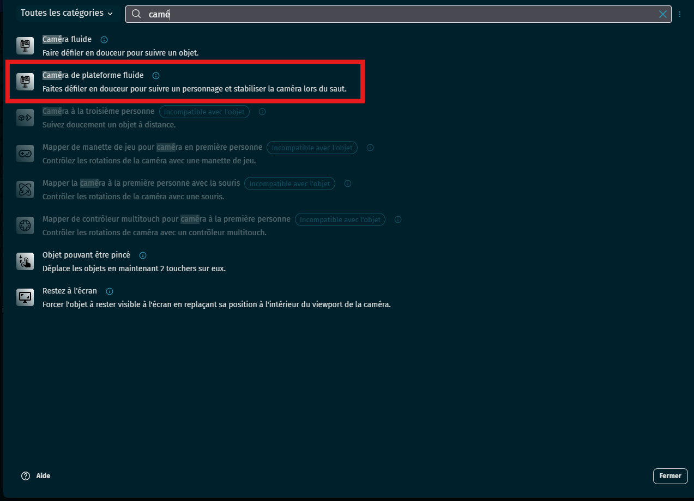
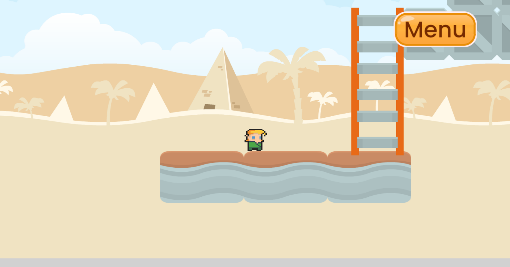
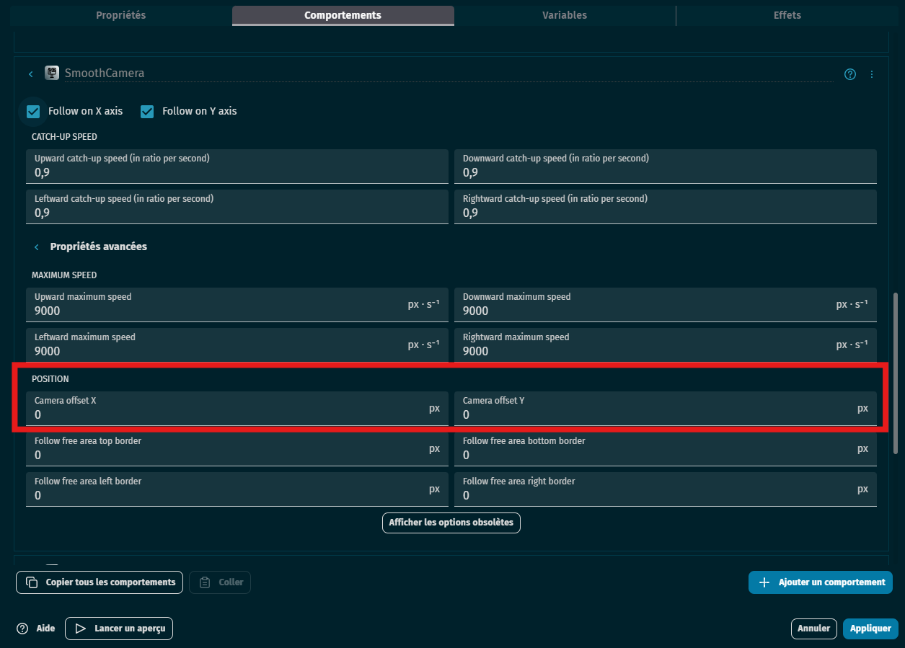
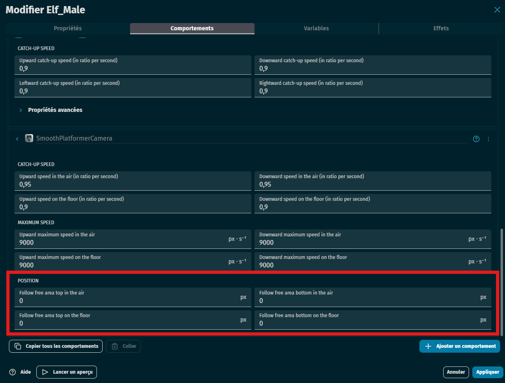

# 🎥 Comportement de caméra automatique dans GDevelop

## 🧰 Pré-requis

- Un **objet joueur** (ex. : "Player")
- Une **scène plus grande que l’écran**

---

## 🪜 Mise en place

### 1. Ajouter le comportement

➡️ Dans l’objet **joueur** :

- Ouvre l’onglet **comportements**
- Ajoute le comportement **"Caméra de plateforme fluide"**

✅ C’est tout !  
➡️ La caméra suivra **automatiquement** cet objet pendant le jeu.

---

## 🧠 Ce que fait la caméra (par défaut)

- Elle suit **en temps réel** la position du joueur
- Elle est **centrée** sur lui (X et Y)
- Elle peut être **modulée** par plusieurs options (voir ci-dessous)

---

## 🧭 Comprendre les axes

| Axe | Direction |
|-----|-----------|
| `X` | ➡️ Vers la **droite** |
| `Y` | ⬇️ Vers le **bas** |

---

## 🔍 Paramètres avancés du comportement

### 1. Offset (Décalage caméra)

> Permet de ne **pas centrer parfaitement** la caméra sur le joueur, mais de **voir devant** ou ailleurs.

| Offset X | Résultat |
|----------|----------|
| `+100`   | Caméra décalée **vers la droite** |
| `-100`   | Caméra décalée **vers la gauche** |

| Offset Y | Résultat |
|----------|----------|
| `+50`    | Caméra descend plus bas |
| `-50`    | Caméra plus haut (utile en plateforme) |

---

### 2. Zone libre (Follow Free Area)

> C’est une **zone autour du joueur** dans laquelle il peut se déplacer **sans faire bouger la caméra**.

| Paramètre         | Effet                              |
|-------------------|------------------------------------|
| Largeur           | Tolérance gauche/droite            |
| Hauteur           | Tolérance haut/bas                 |

🎯 Plus la zone est grande, plus le joueur peut bouger **sans que la caméra ne suive**. Cela évite une caméra trop saccadée.

---

## ✅ Résultat attendu

- La caméra suit automatiquement le joueur
- Elle peut être centrée ou décalée
- Elle peut être **plus ou moins souple**
- Elle peut offrir un **champ de vision dynamique**
