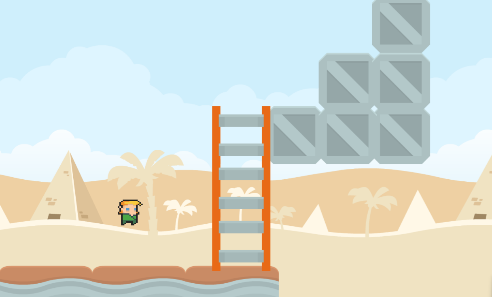
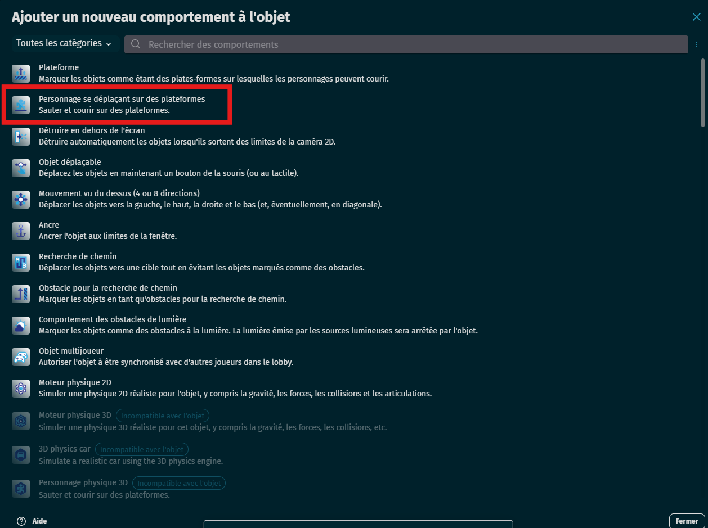
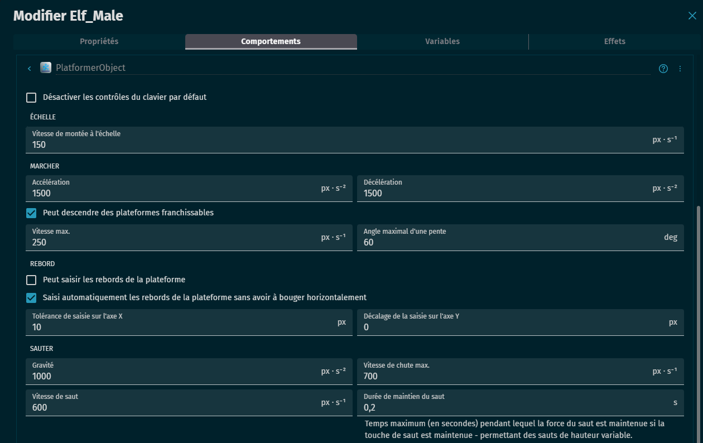
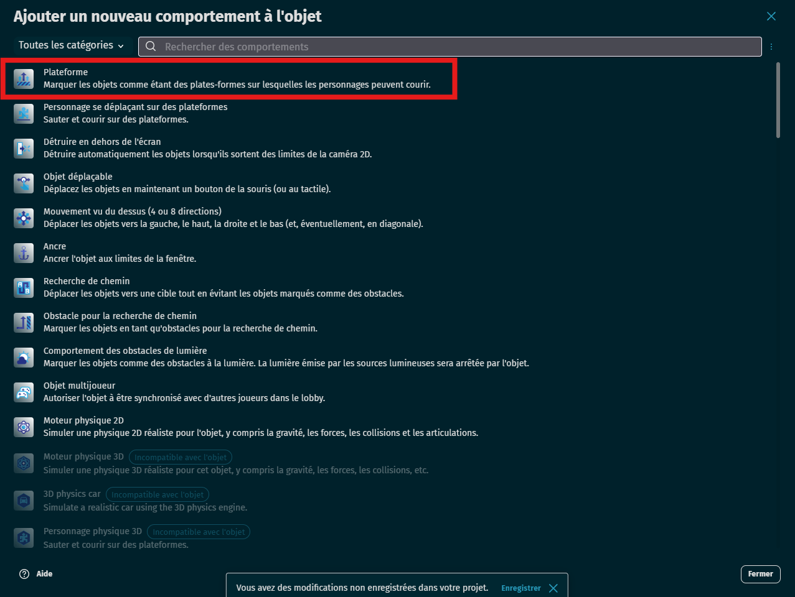
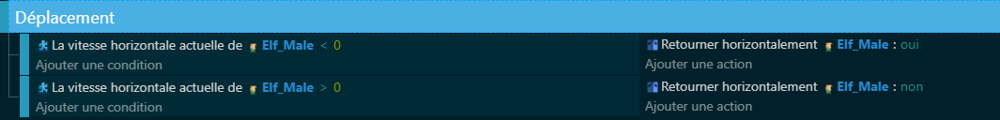

# 🎮 Déplacement du joueur

## 🧰 Ce qu’il faut préparer

- Un personnage (ex : Elf_Male)
- Un sol ou des plateformes (ex : Sol, Bloc, etc.)

---

## 🛠 Étape 1 : Ajouter le comportement au joueur

- Sélectionner le personnage
- Ajouter le comportement **Personnage se déplaçant sur des plateformes**

Ce comportement permet au personnage de marcher, sauter, tomber et glisser selon les lois de la gravité.

---

## ⚙️ Étape 2 : Paramétrer les valeurs du joueur

Tu peux configurer plusieurs paramètres :
- Gravité
- Vitesse maximale
- Force du saut
- Accélération
- Nombre de sauts autorisés
- Peut grimper les pentes
- Peut tomber dans les trous

Ces valeurs peuvent être ajustées selon le style de ton jeu (réaliste, arcade, rapide, flottant...).

---

## 🧱 Étape 3 : Ajouter le comportement aux plateformes

- Sélectionner les objets qui serviront de sol
- Ajouter le comportement **Plateforme**

C’est obligatoire pour que le personnage puisse marcher dessus ou interagir avec.

---

## 🎮 Étape 4 : Utiliser les contrôles par défaut

Pas besoin de coder ! Les touches suivantes fonctionnent automatiquement :
- Flèches gauche/droite ou A/D : déplacement
- Flèche haut ou Espace : saut

Les touches peuvent être désactivées si l’on veut programmer ses propres contrôles.

---

## 🎭 Étape 5 : Faire tourner le personnage dans le bon sens

Si ton personnage regarde toujours à droite, tu peux lui ajouter le comportement **Flippable** pour qu’il tourne selon la direction du déplacement.

On peut alors utiliser des événements pour dire :
- Si le joueur va vers la gauche, on retourne le sprite
- Si le joueur va vers la droite, on remet le sprite à l’endroit

---

## 📌 À retenir

- Le comportement "Personnage se déplaçant sur des plateformes" est essentiel pour les jeux de type Mario, Celeste, ou Hollow Knight.
- Il fonctionne en combinaison avec le comportement "Plateforme" sur les objets du décor.
- Il permet de gagner beaucoup de temps : pas besoin de tout coder !

---

## ✅ Résultat attendu

Les élèves doivent être capables de :
- Ajouter les bons comportements
- Déplacer un personnage de gauche à droite
- Le faire sauter correctement
- Comprendre comment personnaliser la physique du jeu
