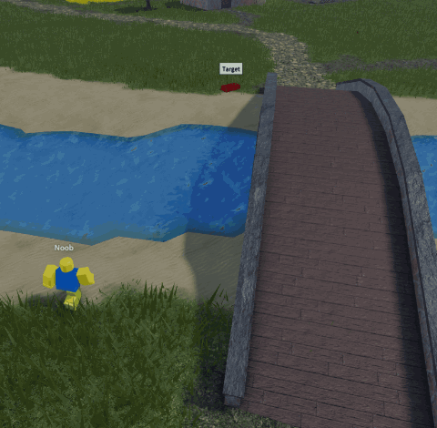
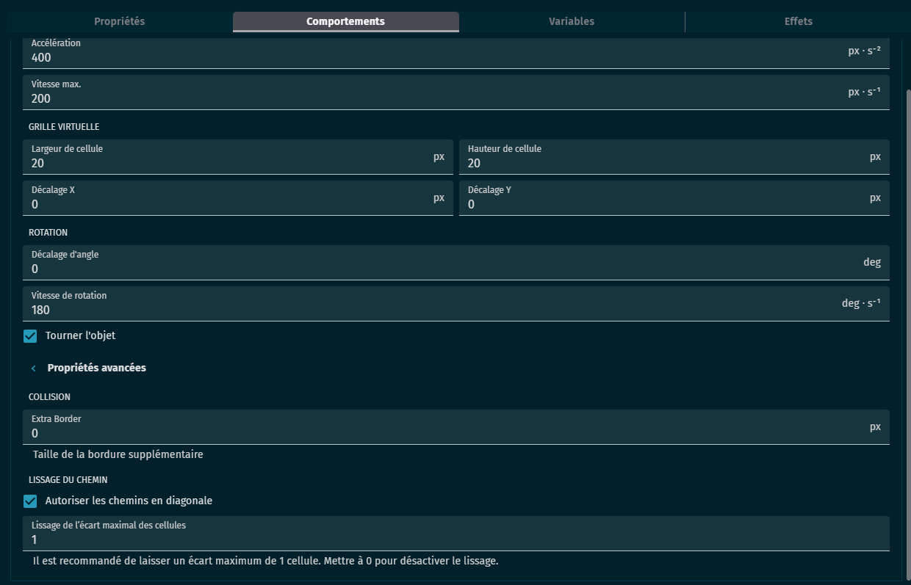
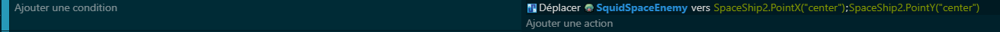

# 👾 Module – Déplacement des ennemis avec Pathfinding

## 🎯 Objectif

Apprendre à utiliser le comportement **Pathfinding** pour permettre à un ennemi de **se déplacer automatiquement** dans la scène, en contournant les obstacles et en suivant une cible (par exemple, le joueur).

---

## 🧠 Qu’est-ce que le Pathfinding ?

- Le **Pathfinding** est un système qui permet à un objet de trouver un **chemin optimal** dans un environnement rempli d’obstacles.  
- Au lieu d’aller tout droit, l’ennemi calcule un itinéraire pour atteindre sa **cible** en évitant les murs, les blocs ou les zones interdites.  
- C’est le même principe que dans de nombreux jeux où les ennemis **poursuivent le joueur** de façon intelligente.

---

## ⚙️ Les paramètres du comportement

Quand on ajoute le comportement **Pathfinding** à un objet (ex. : `Enemy`), plusieurs paramètres sont disponibles :

- **Cell width / Cell height** : taille de la grille utilisée pour calculer le chemin.  
  → Plus les cellules sont petites, plus le chemin sera précis (mais plus coûteux en calcul).  

- **Max speed** : vitesse maximale de déplacement de l’ennemi.  
- **Acceleration** : vitesse d’accélération quand l’ennemi démarre son mouvement.  
- **Angular max speed** : vitesse maximale de rotation (si l’ennemi tourne).  
- **Rotate object** : permet de **tourner automatiquement l’objet** dans la direction du mouvement.  
- **Allow diagonals** : autorise les déplacements en diagonale.  
- **Extra border** : marge de sécurité pour éviter que l’ennemi colle trop aux obstacles.  

---

## 🪜 Mise en pratique

### 1. Préparer la scène
- Crée un objet `Enemy` et ajoute-lui le **comportement Pathfinding**.  
- Place des **obstacles** (murs, caisses, blocs).  
- Donne-leur le comportement **Obstacle pour le pathfinding** afin qu’ils soient pris en compte dans le calcul du chemin.

### 2. Définir une cible
- La cible peut être :
  - **Le joueur** (poursuite).  
  - Une **position précise** (patrouille).  

### 3. Lancer le déplacement
- Dans un événement, on peut demander à l’ennemi de :
  - **Aller vers un objet** (ex. : `Player`).  
  - **Aller vers une position X/Y** définie.  

---

## ✅ Résultat attendu

- L’ennemi se déplace automatiquement dans le décor.  
- Il **évite les obstacles** au lieu de rester bloqué.  
- Il peut **poursuivre le joueur** ou suivre un chemin prédéfini.  

---

## 💡 Astuces

- Utilise un **cooldown** ou une condition de distance pour éviter que l’ennemi recalcule trop souvent son chemin (optimisation).  
- Combine le **Pathfinding** avec d’autres comportements (tir à distance, attaque au corps à corps).  
- Les obstacles peuvent être **dynamiques** (déplaçables) : l’ennemi recalcule son chemin en fonction des changements.  
- Tu peux créer plusieurs **types d’ennemis** avec des vitesses différentes (rapides, lents, gros).  

---
