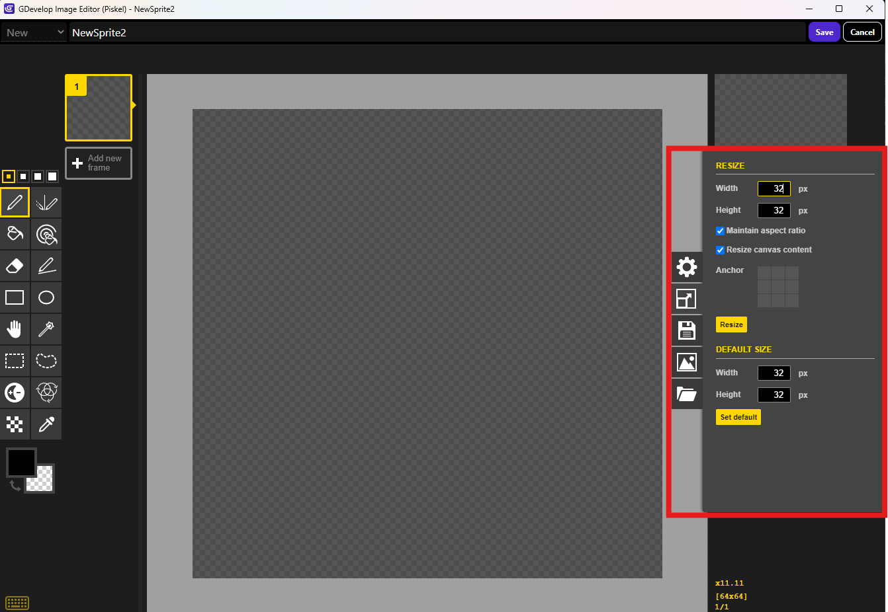
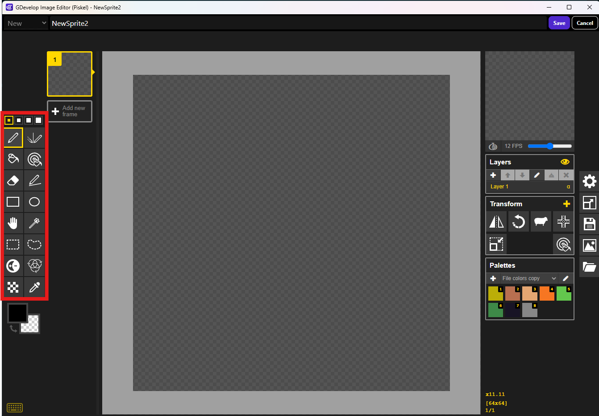
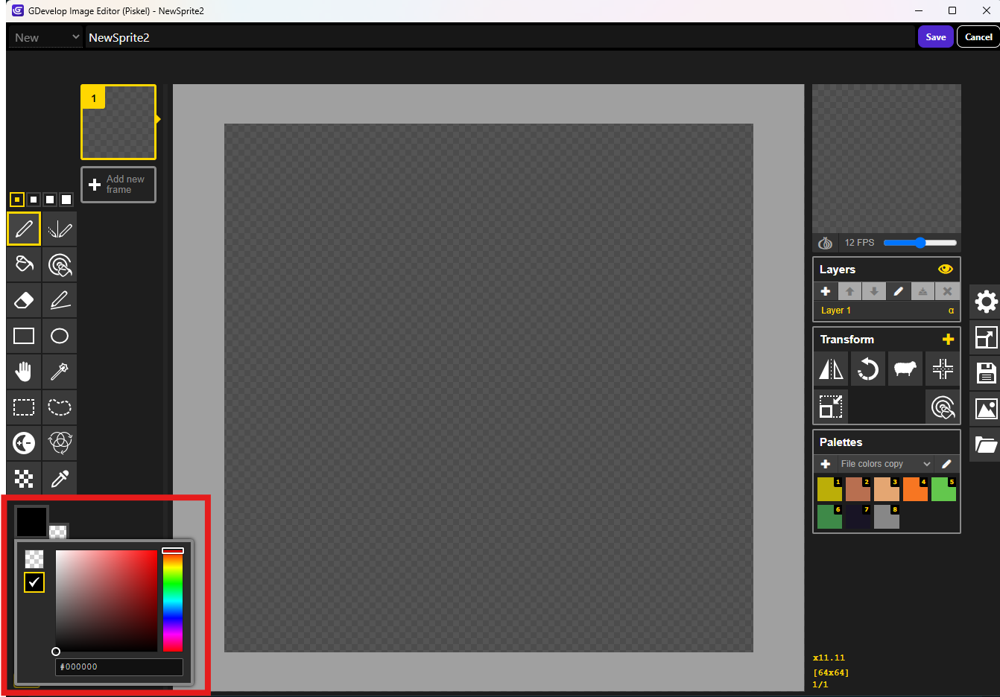
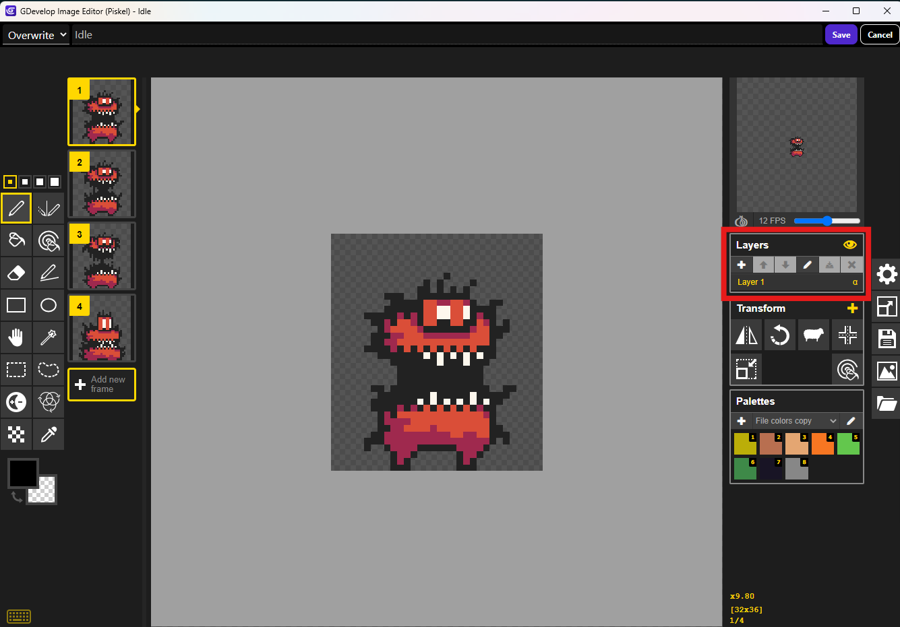
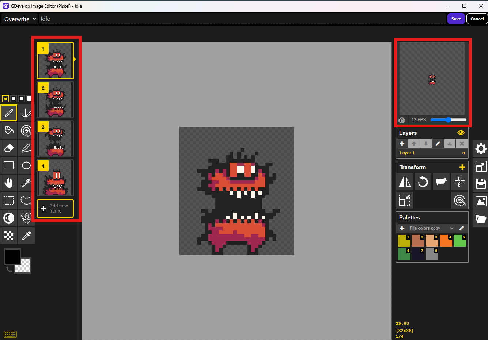
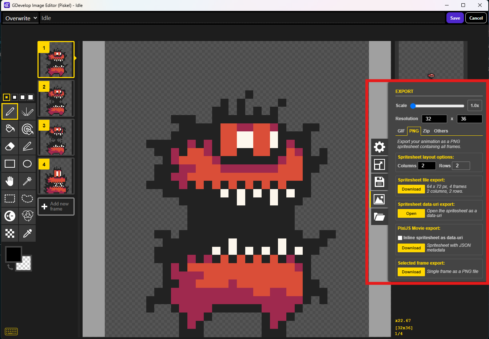

# 🎨 Cours Pédagogique : Initiation à Piskel

## 🧰 Étape 1 : Configurer le canevas
1. Cliquer sur **"Create Sprite"** pour commencer un nouveau projet.
2. Changer la taille du canevas :
   - Cliquer sur **“Resize”** (en haut).
   - Entrer une taille comme **32x32** ou **16x16** (idéal pour débutants).
   - Valider pour appliquer.

---

## 🎛️ Étape 2 : Découvrir les outils

| Outil        | Icône  | Utilité                                      |
|--------------|--------|-----------------------------------------------|
| Crayon       | ✏️     | Dessiner pixel par pixel                      |
| Ligne        | /      | Dessiner une ligne droite                     |
| Formes       | ◯ ▭    | Carrés et cercles pleins ou vides            |
| Seau         | 🪣     | Remplir une zone de couleur                   |
| Gomme        | ⛔     | Effacer un pixel                              |
| Sélection    | 🟦     | Déplacer une zone sélectionnée                |
| Pipette      | 🧪     | Récupérer une couleur dans le sprite          |
| Miroir       | 🔁     | Symétrie horizontale ou verticale             |
| Zoom         | 🔍     | Agrandir ou réduire la vue                    |
| Main         | ✋     | Déplacer la vue (si zoomé)                    |

---

## 🎨 Étape 3 : Dessiner son sprite
1. Sélectionner le **crayon**.
2. Choisir une **couleur** dans le sélecteur.

3. Dessiner un **personnage ou objet simple**.
4. Utiliser la gomme pour corriger.
5. Changer de couleur si besoin.

💡 *Conseil : proposer un modèle simple comme un slime ou une pièce d’or.*

---

## 🖌️ Étape 4 : Utiliser les calques (facultatif)
1. Ouvrir l’onglet **“Layers”** (à droite).
2. Ajouter un **nouveau calque** (ex : pour un accessoire).
3. Dessiner sur ce calque sans modifier le reste du sprite.

---

## 🎞️ Étape 5 : Créer une animation
1. Cliquer sur **“+”** dans la timeline (en bas).
2. Modifier légèrement le sprite pour l’image suivante.
3. Cliquer sur **“Play”** pour voir l’animation.
4. Régler la **vitesse de lecture** avec le curseur.

---

## 💾 Étape 6 : Sauvegarder / Exporter
1. Cliquer sur **"Save"** pour enregistrer le projet (.piskel).
2. Cliquer sur **"Export"** :
   - **PNG** pour sprite simple
   - **GIF** pour sprite animé
   - Cocher **“transparent background”** si besoin

---

## 🎯 Étape 7 : Réutiliser son sprite dans un jeu
- Importer le PNG dans Gdevelop
- Exporter en **sprite sheet** pour les jeux (option disponible).

