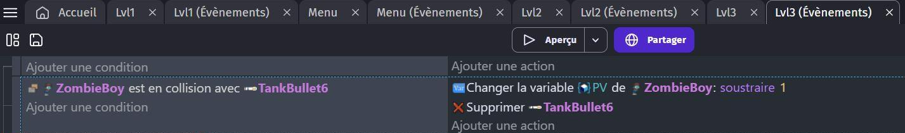

# ❤️ Module – Points de vie des ennemis

 

## 🧰 Besoins

- Un **ennemi**
- Un **projectile**

---

## 🪜 Étapes

### 1. Créer une variable "PV" pour l’ennemi

- Clique sur l’objet **ennemi** dans la scène
- Ouvre l’onglet **Variables**
- Clique sur **Ajouter une variable**
- Nom : `PV`
- Type : **Nombre**
- Valeur de départ : `5`

 

---

### 2. Enlever 1 PV à l’ennemi quand il est touché

- Crée un **événement** :
  - **Condition** : L’ennemi est en **collision avec un projectile**
  - **Actions** :
    - **Soustraire 1** à la variable `PV` de l’ennemi
    - **Supprimer** le projectile

   

---

### 3. Détruire l’ennemi à 0 PV

- Crée un **nouvel événement** :
  - **Condition** : La variable `PV` de l’ennemi est **inférieure ou égale à 0**
  - **Action** : **Supprimer l’ennemi**

 

---

## ✅ Résultat attendu

- L’ennemi perd **1 PV à chaque impact**
- L’ennemi **disparaît quand ses PV atteignent 0**
