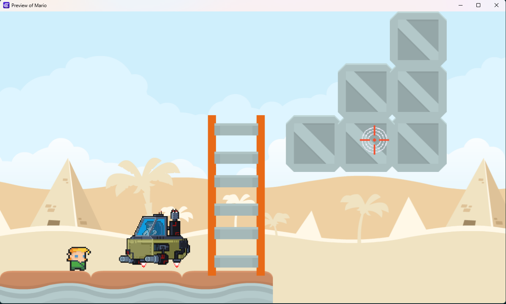
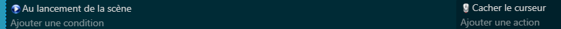
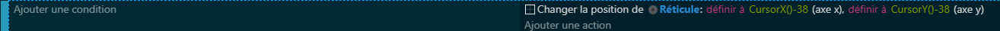
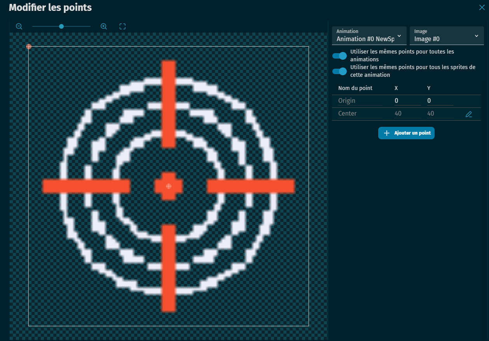

# 🎯 Module – Affichage d’un réticule (crosshair)

## 🎯 Objectif

Remplacer le **curseur système** par un **réticule personnalisé** (crosshair) qui suit la souris.  
Comprendre pourquoi un **décalage** est nécessaire pour centrer l’image sur la position du curseur.

---

## 🧰 Besoins

- Une **image de réticule** (par ex. une cible PNG)  
- L’objet **Réticule** dans GDevelop  
- Un événement pour **masquer le curseur**  
- Un événement pour **faire suivre le réticule à la souris**

---

## 🪜 Étapes

### 1. Créer l’objet réticule
- Ajoute un nouvel objet **Sprite**
- Nom : `Réticule`
- Charge l’image de ton réticule
- Mets-le dans la scène

---

### 2. Masquer le curseur système
- Dans les **événements**, ajoute une condition :
  - **Au début de la scène**
- Action associée :
  - **Masquer le curseur de la souris**

---

### 3. Déplacer le réticule avec la souris
- Dans les événements :
  - Action : **Mettre la position de `Réticule` à la position du curseur**
  - N’oublie pas d’ajouter un **décalage** pour que le centre du réticule corresponde à la souris.

---

## 🧠 Comprendre l’affichage d’une image en informatique

- Une image est **lue pixel par pixel** par l’ordinateur :  
  - **Premier pixel** : en **haut à gauche**  
  - Lecture : de **gauche à droite**, puis retour à la ligne  
  - Ensuite l’image est lue **de haut en bas**  
- 👉 Exactement comme la lecture en France (ligne par ligne)

➡️ **Conséquence :**  
Quand tu places une image en `X, Y`, l’ordinateur **aligne son coin supérieur gauche** avec cette position.

---

## 📐 Pourquoi un décalage est nécessaire

Un réticule est censé avoir son **centre** aligné avec la souris.  
Mais comme l’ordinateur aligne toujours le **coin haut gauche**, le centre n’est pas correct sans correction.

➡️ Il faut donc **soustraire la moitié de la largeur et la moitié de la hauteur** du sprite.

Exemple :  
- Si le réticule fait **76 x 76 px**,  
- Décalage nécessaire = `-38` en X et `-38` en Y.  
- Ainsi, le **centre du réticule** correspond à la **position réelle du curseur**.

---

## ✅ Résultat attendu

- Le curseur système est masqué (par événement au début de la scène)  
- Le réticule personnalisé suit la souris  
- Le centre du réticule est parfaitement aligné sur le curseur  

---

## 💡 Astuces

- Si tu changes la taille du réticule, ajuste le décalage (moitié largeur / moitié hauteur).  
- Tu peux ajouter une **animation de réticule** (ex : flash quand on tire).  
- Combine avec le système de tir pour plus de réalisme.  
